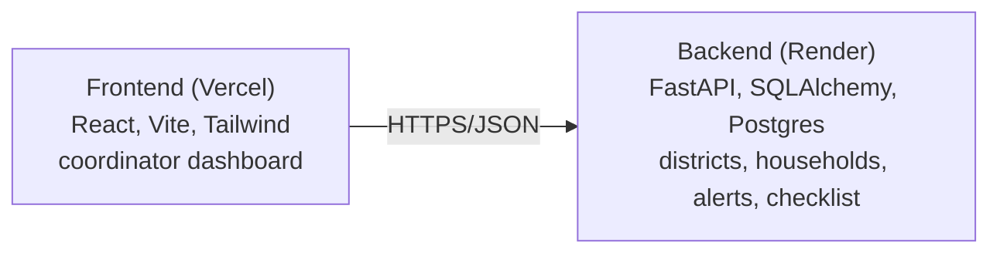

# Baadh Mitra — Flood Relay Coordinator


[](https://baadh-mitra.vercel.app/)

Turns a flood alert into a prioritized, door-to-door warning checklist for volunteer relay teams.

**Live:** https://baadh-mitra.vercel.app/

## What it does

Flood forecasting systems like Google's Flood Hub can predict river levels up to seven days ahead, reaching hundreds of millions of people. But in areas without direct smartphone reach, the actual warning still depends on a volunteer going door to door with no tooling to help decide who to reach first. The forecast is solved. Deciding which household needs the volunteer first is not.

Baadh Mitra fills that gap. A coordinator maps a district's households once (elderly-only, no resident smartphone, low-lying, limited mobility), and every time an alert comes in, the app generates a ranked, explainable checklist that puts the most vulnerable households at the top. Not affiliated with Google.

**Highlights**
- Full-stack, independently deployed: FastAPI backend on Render, React frontend on Vercel, connected over HTTPS with its own CORS boundary
- Prioritization is explainable. Every ranked household carries the specific reasons behind its score, not just a number
- Built, deployed, and debugged against real platform constraints: Python version pinning, region selection, free-tier database expiry, build caching

## Architecture



- **Backend** (`backend/`): FastAPI app, SQLAlchemy models, a prioritization engine (`app/prioritization.py`), and a simulated flood-gauge feed (`app/flood_feed.py`) standing in for a real Flood Hub integration (see Limitations below).
- **Frontend** (`frontend/`): a single-page React dashboard. Pick a district, see the active alert with a river-gauge severity indicator, manage the household roster, and work through the ranked checklist in real time.

## Running it locally

**Backend**
```bash
cd backend
python -m venv .venv && source .venv/bin/activate
pip install -r requirements.txt
cp .env.example .env
python -m app.seed
uvicorn app.main:app --reload --port 8000
```
Interactive API docs at `http://localhost:8000/docs`.

**Frontend** (second terminal)
```bash
cd frontend
npm install
cp .env.example .env
npm run dev
```
Runs at `http://localhost:5173`.

## Deploying: Render (backend) + Vercel (frontend)

Push to a GitHub repo first:
```bash
cd baadh-mitra
git init
git add .
git commit -m "Baadh Mitra: flood-relay coordinator MVP"
git branch -M main
git remote add origin https://github.com/<your-username>/baadh-mitra.git
git push -u origin main
```

### 1. Backend to Render

1. Render dashboard → **New +** → **Blueprint**.
2. Connect the repo. Render reads `backend/render.yaml` and proposes a free Postgres database (`baadh-mitra-db`) and a free web service (`baadh-mitra-api`) with `DATABASE_URL` wired automatically.
3. Click **Apply**. First deploy installs dependencies, seeds demo data as part of the start command, then starts uvicorn.
4. Confirm it works: `curl https://baadh-mitra-api.onrender.com/health` returns `{"status":"healthy"}`.

   > Render's free tier spins the service down after inactivity. The first request after a quiet period can take 30 to 60 seconds to wake up. Not a bug.

   > `render.yaml` pins `PYTHON_VERSION=3.12.3`. Render's default for new services moved to 3.14.3 in February 2026, but the pinned dependencies (`pydantic==2.9.2`, `psycopg2-binary==2.9.9`) were tested against 3.12.3 and aren't guaranteed to have prebuilt wheels for 3.14 yet.

### 2. Frontend to Vercel

1. Vercel dashboard → **Add New** → **Project** → import the same repo.
2. Set **Root Directory** to `frontend`. Vercel auto-detects Vite.
3. Add environment variable `VITE_API_URL` = your Render URL, no trailing slash.
4. Deploy.

### 3. Connect them (CORS)

The backend only accepts requests from origins listed in `ALLOWED_ORIGINS`. On Render, edit that variable to include your Vercel URL:
```
https://baadh-mitra.vercel.app,http://localhost:5173
```
Render redeploys automatically on save. Reload the Vercel site. Districts should load and alerts should simulate end to end.

## Limitations and next steps

- **Flood feed is simulated.** There is no public, self-serve Flood Hub API for arbitrary rivers. `app/flood_feed.py` is written so a real feed could be dropped in behind the same function signature.
- **No offline or peer-to-peer relay yet.** Bluetooth or Wi-Fi Direct propagation between volunteer phones for when connectivity fails during the flood itself, the exact moment it's needed most, is out of scope for this web version. That's the natural next phase, and would need native Android APIs.
- **No authentication.** Anyone with the URL can edit any district's roster. Next step would be simple coordinator accounts per district.
- **Render's free Postgres expires 30 days after creation**, with a 14-day grace period to upgrade before the data is deleted. The free web service also sleeps when idle.

## Project structure

```
baadh-mitra/
├── backend/
│   ├── app/
│   │   ├── main.py            FastAPI app + CORS
│   │   ├── models.py          SQLAlchemy models
│   │   ├── schemas.py         Pydantic request/response schemas
│   │   ├── database.py        engine/session (SQLite locally, Postgres in prod)
│   │   ├── prioritization.py  checklist-ranking logic
│   │   ├── flood_feed.py      simulated Flood Hub-style alert generator
│   │   ├── seed.py            demo data
│   │   └── routers/           districts / households / alerts / checklist
│   ├── requirements.txt
│   ├── render.yaml
│   └── .env.example
└── frontend/
    ├── src/
    │   ├── App.jsx
    │   ├── api.js
    │   └── components/        RiverGauge, AlertBanner, HouseholdPanel, ChecklistPanel, DistrictSwitcher
    ├── package.json
    ├── vercel.json
    └── .env.example
```
